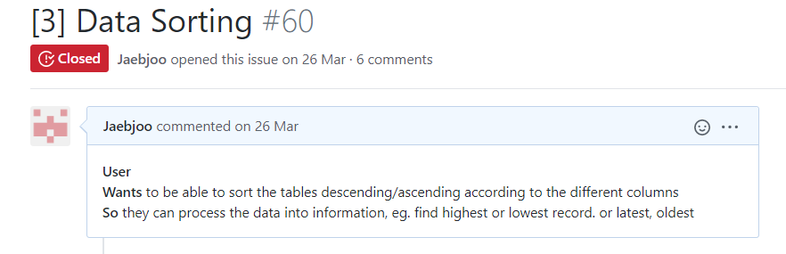

## Azure Research : IoT
# USER STORIES

[NEXT](sprintPlanning.html){: .btn}

**Azure IoT**

[Agile Alliance: User Stories](https://www.agilealliance.org/glossary/user-stories){:target="_blank"}

Azure IoT platform allows management of IoT devices, integrated into the Azure Infrastructure which includes databases, VMs, and most importantly Azure Stream Analytics.

#### Creating IoT Hub

#### Send Telemetry Data

#### Control a device