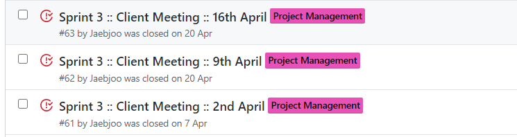
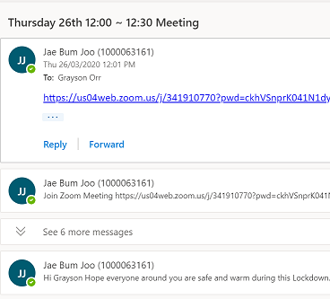
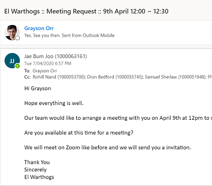
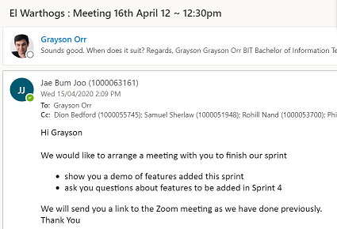

## SPRINT 3 : AGILE PRINCIPLE
# CLIENT MEETING

[NEXT](mythicalManMonth.html){: .btn}
[BACK](definitionOfDone.html){: .btn}

The Agile Manifesto emphasies the need for **customer collaboration** and the best way to achieve **Agile Principle 1** would be to have meaningful and regular client meetings. During Sprint 3 we had a client meeting every week to update the client on how the project was progressing and allowed the client to have input in the development process to adjust anything that they would like changed, added or made differently. I believed that this was important for the overall quality of the product and to maximise the customer's satisfaction. Through this project I was able to value regular client meetings in order to create valuable software.

#### Client Meetings Sprint 3

#### Arranging Client Meetings

