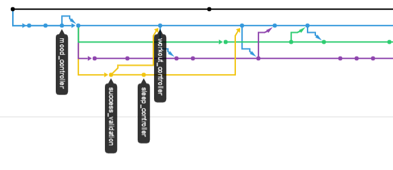
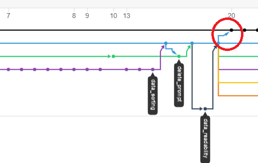

## SPRINT 3 : AGILE PRINCIPLE
# CONTINUOUS DEPLOYMENT

[NEXT](scrumMaster.html){: .btn}
[BACK](mythicalManMonth.html){: .btn}

We had to make sure that "after each integration successfully meeting these release criteria, the live application is updated with new code".

[Agile Alliance: Continuous Deployment](https://www.agilealliance.org/glossary/continuous-deployment){:target="_blank"}

Although we had been developing and merging to the development branch succesfully, we had been reminded that we need to merge to the master branch and have these features live on the master branch. I was reminded by the fact that working features are valuable only when users are able to use them and the client is able to benefit from it. We actually suffered problems deploying the new features. This highlighted the fact that the success of a feature is only reached once it is fully deployed and working on a live environment. It also needs to withstand the variety of use cases that may not have been anticipated in a production environment. We must not only work toward developing, but work toward continuous deployment.

#### ... Finally merging to Master and Deploying Features

