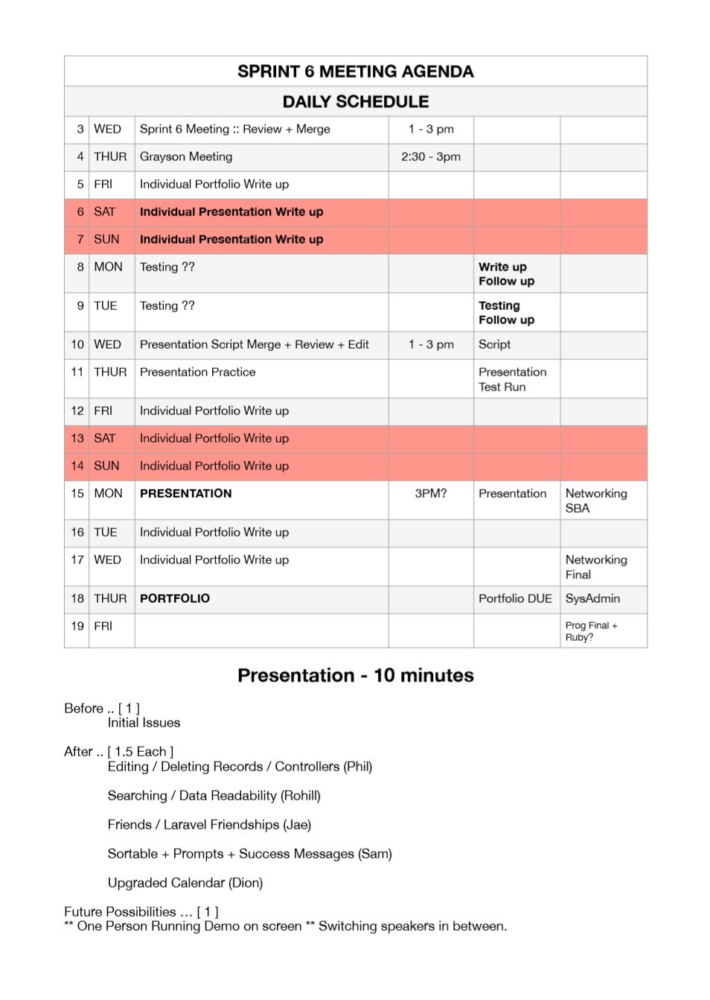
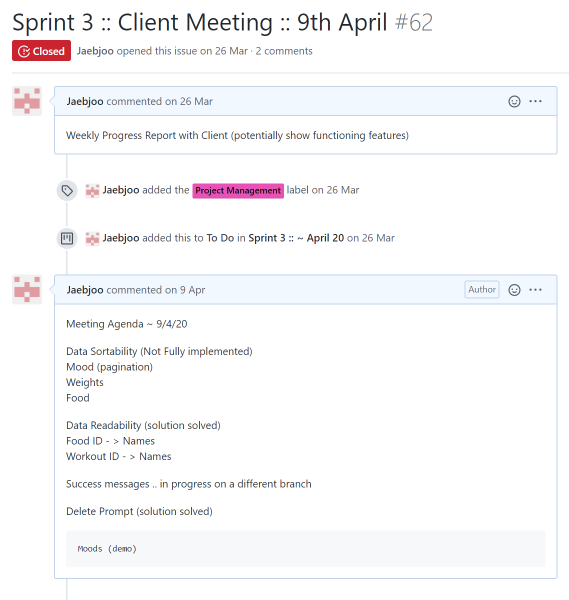

## SPRINT 6 : AGILE PRINCIPLE
# FACILITATOR

[BACK](pairProgramming.html){: .btn}
[FIRST](userStories.html){: .btn}

**Next Section** [PERSONAL ACHIEVEMENTS](pa1.html){: .btn}

"A facilitator is a person who chooses or is given the explicit role of conducting a meeting. This role usually entails that the facilitator will take little part in the discussions on the meeting’s topic, but will focus primarily on creating the conditions for effective group processes, in the pursuit of the objectives for which the meeting was convened." - agile alliance

[Agile Alliance: Facilitator](https://www.agilealliance.org/glossary/facilitation/){:target="_blank"}

I have always considered myself as a facilitator rather than a natural leader. Though I may lack the technical knowledge to lead development, I take the initiative to initiate team interactions. I have often called meetings throughout the semester to spur stagnating development process, organise client meetings and create meeting agendas to ensure that meetings are conducted smoothly, and unnecessarily long discussions and potential conflicts of opinions are minimised. 

### Meeting Agenda Sprint 6

### Meeting Agenda Sprint 3

As the facilitator, I would lead meeting to bring up agendas and invite members to contribute, and voice opinions to reach a consensus as swiftly as possible. 

As Scrum Master, I would try to rally team opinions around a single solution I had suggested as the scrum master fast track development.

I feel having an effective adminstrator who may not be as adept in developing is as important in project management.
Reading the **Mythical Man Month** was highly influencial and I support organising the group into a **surgical team** with a dedicated administrator who handles all the overall project management and facilitation of team meetings and participation which frees up development time for the lead and sub developers.