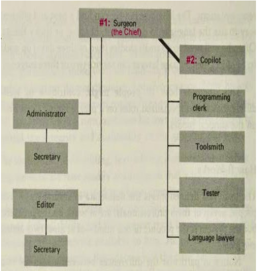

## SPRINT 3 : AGILE PRINCIPLE
# MYTHICAL MAN MONTH (Feat. AGILE)

[NEXT](continuousDeployment.html){: .btn}
[BACK](clientMeeting.html){: .btn}

I finished reading The Mythical Man Month in Week 6.

#### Mythical Man Month

I was intrigued by the Surgical Team Organisation, schedule/time estimation, insight into past communication methods, and productivity measures.

#### Surgical Team Organisation

Reading the book gave me an opportunity to pull wisdom from the failures and successes of past projects and apply these concepts from an AGILE perspective.

**AGILE MANIFESTO :: PRINCIPLE 11**
"The best architectures, requirements, and designs emerge from self-organizing teams."
With regard to team organisation, a "Surgical Team" isn't necessarily against AGILE, as long as it is self organising without external influences, which allows to optimise the team's skill sets.

The book was published in 1975.
Although AGILE Principles hadn't existed, related practices were still carried out in the development process.

Particularly, the book states "The only constancy is change itself and plan the system for change" and personally this approach toward development reflected extreme/agile programming. This seemed to be in line with favouring CUSTOMER COLLABORATION and RESPONDING TO CHANGE by constant feedback from the customer to ask about changing needs. 

I was intrigued by the Surgical Team Organisation. Comparing this concept to a Scrum Master, what was enlightening about this was the need for administrators, clear hierarchy in decision making, clearly distinguished roles within the team. Though in our project, we were expected to contribute to the coding process equally and be fairly involved in the project management. Having division of duties and specialisation would increase productivity and reduce conflicts. This encouraged me to take a stronger leadership during SPRINT 3, where I was the Scrum Master. The most important aspect that I realised was that allocating specialised roles to people was more efficient than each person having an equal role, even if it is SELF-ORGANISING.

The Book revealed how MAN HOURS had very little meaning and value in estimating the time to completion. These problems identified in the past were directly linked to the STORY POINTS and VELOCITY. Coding of a project only accounts for 1/6 of the time, planning 1/3 and various testing accounting for 1/2. I experienced this first hand and agreed with how significant the planning process was and how arduous the testing and debugging process is. Intercommunication and training of team members also creates more delays. I experienced this in Sprint 3 as I wondered if it would be faster for me to code something by myself rather than training other members and sharing the workload.

Methods of COMMUNICATION in the past involved TELEPHONE calls, FAX, Meetings, and writing in "WORKBOOKS". It was insightful to learn about communication issues in the past. It was vastly different to how it was now, and it was amusing reading about this topic as I was regularly messaging my team members on SLACK, commenting on GITHUB, and having video meetings on ZOOM. I also realised how convenient it is now to carry out version control and collaborate by simply "pulling", "merging", "committing" and "pushing" than in the past to DELIVER WORKING SOFTWARE FREQUENTLY as they may have worked towards a physical product launch rather than updates and downloads over the Internet. This only emphasised the importance of clear and efficient FACE TO FACE communication to effectively coordinate the team.