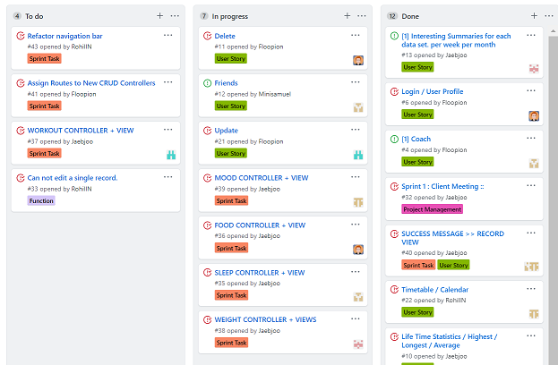
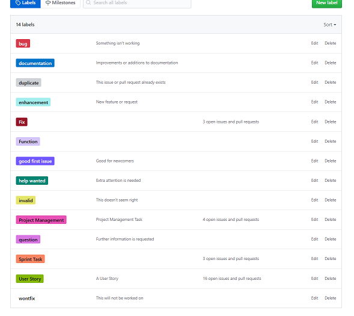
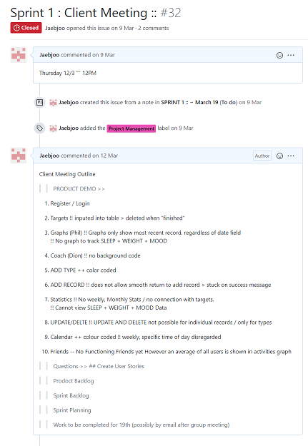

# SPRINT 1 : Personal Achievement

[NEXT](pa2.html){: .btn}

**Previous Section** [AGILE PRINCIPLES](userStories.html){: .btn}

## Kanban Board Management
Although I was aware of the concept of KanBan Boards through Trello, it was the first time using KanBan Boards extensively in a project.
I have always comfortable taking on an administrative role in a project.
Although aspects of the Kanban board was simplified in Sprint 3, TAGS were used extensively to organise the kanban board and also allocate tasks to team members.

** Finding the best method of organising the kanban board would also be an iterative process and the best labels and practices would be worked out by sprint 3. It was a learning experience to realise that each team member would think differently in organising things and prefer particular labels over others. There was also a need to balance DETAIL and SIMPLICITY. The more information was attached to a "card" or "issue" the more complicated it would be.

I understood that future projects would require a meeting at the start of the project that laid out how these pieces of information would be organised, where the team would agree on "tags" "list names" etc.

#### Kanban Board

#### Labels

## Running a Client Meeting

I emailed the client to set up the meeting.

I lead the client meeting on March 12th at 12 pm with the client. The Demo was run with Rohill and Sam taking down client's comments. 
I created a meeting agenda. 

I ran through the mock meeting with team members before the client arrived. This was done to minimise time wasted and test functions of the website and avoid unexpected issues. We had been promised 30 minutes. We ran through the demo in 10 minutes flawlessly, and spent 20 minutes discussing future features. I wanted to take up the least amount of the client's valuable time. I believe that meetings involving product demos should be rehearsed and this would be done in following product demos with the client.

