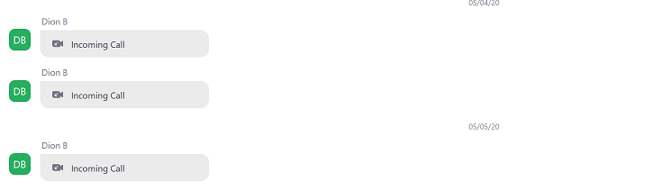
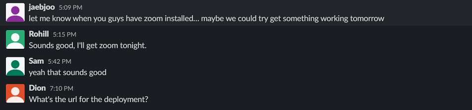

# SPRINT 2 : Personal Achievement

[NEXT](pa3.html){: .btn}
[BACK](pa1.html){: .btn}

## Team Communication -  Remote Workspaces

After the outbreak of the corona virus pandemic. It was important to establish clear routes of communication. Fortunately, the team already had a SLACK workspace established for general chat. Though we did comment on GITHUB, this was mostly for documentation.

#### Communication on Zoom

#### Communication on Slack

I downloaded ZOOM after a team decision in order to carry out face to face communications. We carried out stand up meetings, and tried to establish a regular set of hours between 1 - 5, however it was difficult to manage with team members having work during these hours.

We would leave messages on SLACK if we needed to pass on information.

I was able to gain a lot of experience working remotely, and using tools like screen sharing and video meetings to

* conduct meetings
* train/educate/pair program code
* assist bugs and merge conflicts