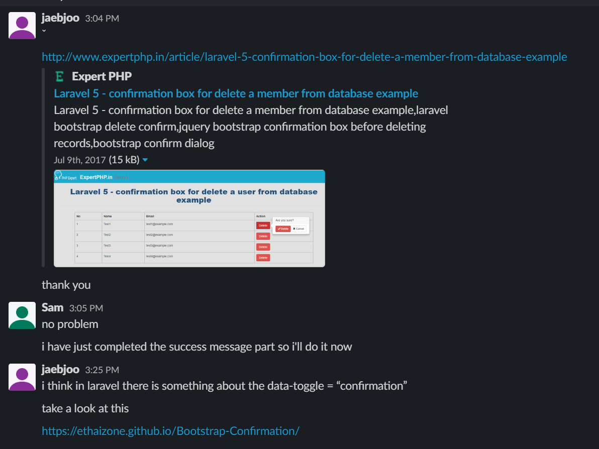

# SPRINT 3 : Personal Achievement

[NEXT](pa4.html){: .btn}
[BACK](pa2.html){: .btn}

## Agile Technique - Scrum Master

During Sprint 3 I took on the role as Scrum Master.
I had also finished reading the book "Mythical Man month and this helped me formulate my ideas on how to organise and manage the group.

The other group members were happy for me to lead the group, and I took the initiative to initiate most coding and project management aspects of this sprint.

#### Research of possible solutions as scrum master

## Administrator - Communication and Training is KEY
One of the most difficult aspects of the sprint was to maintain a consistent level of work hours, which also coincided at the same time. To explain in detail, members had different work availabilities as we each had to balance work, study and life. It was rare to have all 5 members online at the same time. It was my job to make sure that each member knew what was happening throughout the sprint, and this could involve one on one meetings with each member to inform them on their individual tasks and awareness of other member's progress. So I would often have 4 different meetings during the day or week to catch members up and also train them on code implementation.

#### Passing on solutions to members so that they can implement the features

## Uno Animo
In the book "The Mythical Man Month", the writer suggests organising the group as a surgical team. There would be only ONE head surgeon doing the cutting and other members would be there to assist. There was also the concept of an architect and implementers. 

I took the initiative to try organising the team in this manner. To have one sole mind/architect in the development made streamlined the decision making process.

I was able to find implementation solutions to the sorting of tables with the kyslik package. I tested, and showed a working concept to each member and ensured that they understood how it was to be implemented. I understood that controlling the implementation process may have restricted the freedom for members, but it simplified their workflow.

Simplification of the workflow reduced delays in implementation, minimised potential conflicts in opinions. 

I would leave comments throughout the code to make sure each member is coding in the correct place, and they would know what to code. 

I would check back with them to make sure that it has been implemented, and review lines of code after completion.

Though it was effective in the end in coordinating without any merge conflicts and problems in coding, it was time consuming. I understand that this is the cost of coordinating the team and the time lost due to poor coordination would exceed this. I tried to be as inclusive as possible in the development process, informing the members of every minor detail and answering questions they had on how a package worked.

I personally enjoyed being a scrum master, as an administrative role as well as a technical lead role. I felt that the sprint progressed without many delays and I was able to monitor the progress and adjust schedules, allocate tasks and follow up on members easily. In my opinion, past projects without any sort of leadership fails to be more productive than it could be. Storming process of a team is incomplete and members are prone to splintering, and often leading to breakdown in communication, motivation as well as progress. Even if a scrum master may not be the most technically adept, having an administrator monitoring progress spurred development aligned the member's productivity towards a single objective.