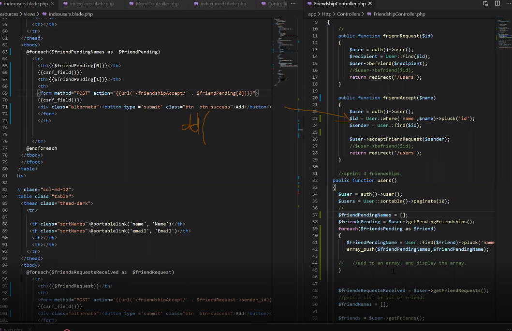

# SPRINT 5 : Personal Achievement

[NEXT](pa6.html){: .btn}
[BACK](pa4.html){: .btn}

## Agile Technique - Pair Programming

The group had initially broken into 3 sub groups to develop 3 different features simultaneously this sprint.

Detailed / Interactive Calendar : Dion + Sam
Searching : Rohill
Friendships : Jae + Phil

Though I was meant to be developing with Phil, I found myself often working without Phil, who was unable to commit regular hours.
I used pair programming to push through issues in developing with Dion and Rohill in a Zoom call.

#### Debugging code with Rohill and Dion in a Zoom Call

**AGILE PRINCIPLE 5 :**
"Build projects around motivated individuals. Give them the environment and support they need, and trust them to get the job done."

It was difficult to rely on Phil to contribute to the development process on a regular basis, however, the agile technique provided me with sufficient support to develop the feature.

I would be the **Driver** with Dion and Rohill as **Navigators**.
There was an initial short period where I would have to explain the logic of the code and the mechanisms, however their oversight was invaluable to the development process. The **Screensharing** feature was used as we were all working remotely and the navigators would draw on my screen to guide me in the troubleshooting process. All of the coding was completed by me but it was a good team experience. 

## Agile Technique - Timeboxing

Time Boxing was used in the process of developing this feature. This limited time wastage and maximised productivity. 

I worked in **30 minute time boxes** trying to develop individual components of the Friendship feature

- User page
- Friendship Controller
- Add buttons
- User tables
- pending request Tables

Laying out the individual components that needed to be developed allowed me to visualise the scope of the feature. And manage time efficiently and maximise output.

I would try to complete a task in 30 minute time boxes and call Dion and Rohill on Zoom for **Pair Programming** only if I have to in order to minimise the time that I take from them developing their own features. The entire team would not all be rallied to tackle a problem that a few people could solve.

Time Boxing overall allowed me to efficiently allocate time, but it because I was forcing myself to have a iterative process I was able to give myself a chance to **reflect** and "take a step back" after each timebox. Having allocated 4 time boxes of 30 minutes where I had a chance to reflect and develop individual components in manageable pieces was better than allocating myself a single "2 hour session to develop friendships". I would often get "tunnel vision" when I get stuck on a problem and start to panic trying to work on a whole feature at once, but working in time boxes forced me to take short intervals in between where I could take some time to think about what I need to do next.