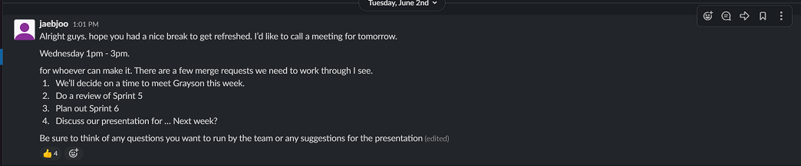

# SPRINT 6 : Personal Achievement

[BACK](pa5.html){: .btn}
[FIRST](pa1.html){: .btn}

**Next Section** [TECHNICAL ACHIEVEMENTS](ta1.html){: .btn}

## Agile Technique - Facilitator
The Scrum master for the sprint was Dion, I did not want to take a leading role in the sprint itself, but I wanted to initiate certain meetings and discussions so that the sprint would continue to progress without making any decisions myself. I have always felt that I am comfortable in the project in an administrative role, being in charge of the management of the project.

#### Setting up Meetings and Setting agendas

I would set up meetings and create meeting agendas beforehand so that the meeting would be run smoothly as possible and minimise conflicts in opinion during the meeting itself. Any issues with the meeting agenda would be encouraged to be brought up before the meeting and worked out in chat. 
There would be a general consensus during the meeting about the agendas, a unanimous decision about schedules, tasks, duties would be reached almost immediately. The meeting would be an opportunity for the team to express their thoughts, and opinions. 
Though I wasn't officially assigned this role, I took on the role as a facilitator to make sure time was efficiently used and more time could be spent developing and testing during this sprint without compromising the integrity of meetings and the team/collective decision making process about tasks and schedules.