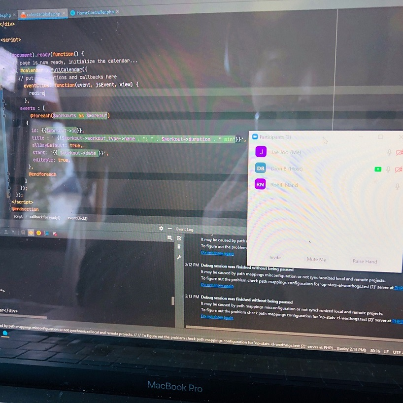

## SPRINT 5 : AGILE PRINCIPLE
# PAIR PROGRAMMING

[NEXT](facilitator.html){: .btn}
[BACK](timeBox.html){: .btn}

I was introduced to the concept of Pair Programming as I was researching agile concepts to get a better understanding how to be more AGILE.

[Agile Alliance: Pair Programming](https://www.agilealliance.org/glossary/pairing/){:target="_blank"}

Pair Programming involves a **"Driver"** who is controlling the mouse and keyboard and actively writing the code, with a **"Navigator"** who is observing and advising the driver beside them. Although previously we would be helping each other in some way, we should convert to actively using this technique and referring to terms such as **Driver** and **Navigator**. The use of pair programming was effective in solving problems as there were more eyes on potential errors in code as it is being written and both programmers are **actively engaged** on a single problem. It is especially effective as there is always a person who is **programming out loud** and this can either be actual code, or even pseudocode.

#### Solving Problems as a with a Driver and Navigators

#### Solving Problems as a with a Driver and Navigators2

This emphasises the fact that development speed does not depend on man power, man hours nor the number of actively coding **hands**. I felt that sometimes, two minds with a single pair of hands was better than 2 pairs of hands coding different parts.

I would use this agile technique more often to review code and troubleshoot with team members, not only in this web software engineering project, but also in programming and system administration.