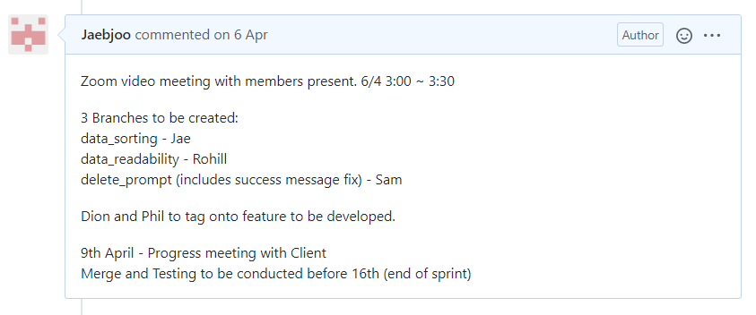

## SPRINT 1 : AGILE PRINCIPLE
# SPRINT PLANNING

[NEXT](standUpMeeting.html){: .btn}
[BACK](userStories.html){: .btn}

**Sprint Planning using Kanban Boards for Incremental Development**

[Agile Alliance: Sprint Planning](https://www.agilealliance.org/glossary/sprint-planning/){:target="_blank"}

The team would develop during SPRINTS which would be 3 weeks long.

**AGILE MANIFESTO :: PRINCIPLE 3**
"Deliver working software frequently, from a couple of weeks to a couple of months, with a preference to the shorter timescale."

We would communicate with the Client during meetings to decide which USER STORIES from the PRODUCT BACKLOG we would develop during the SPRINT. The team would distribute tasks during the initial SPRINT PLANNING. The team would use KANBAN BOARDS to organise task cards so the team can visualise and monitor tasks which are planned, in progress and complete.

#### Sprint Planning Evidence

We would REVIEW the SPRINT based on how the tasks were progressed through the board.