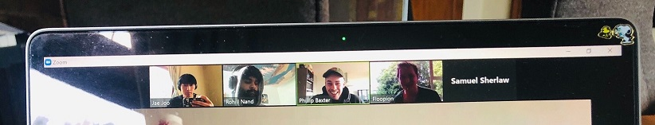

## SPRINT 1 : AGILE PRINCIPLE
# STAND UP MEETING + FACE TO FACE MEETINGS

[NEXT](definitionOfDone.html){: .btn}
[BACK](sprintPlanning.html){: .btn}

The team conducted Stand Up meetings to keep track of how each team member was doing and also share progress made or challenges faced. 

**Individuals and interactions over processes and tools**

**AGILE MANIFESTO :: PRINCIPLE 6**
"The most efficient and effective method of conveying information to and within a development team is face-to-face conversation."

I tended not to leave messages to team members who may not have attended a meeting or a class, opting instead to talk to them the next time we meet face to face. Rather than investing time to explain in detail what had happened and what a member may have missed or needed to be caught up with, I would tell them that I would like to talk to them face to face another time to talk about a particular topic instead.

It was an opportunity to share personal time management problems that may be obstructing a work schedule. Even leaving a message on SLACK on tasks being undertaken for a given day was sometimes neglected. Though I believe it is a good practice, it was not easy to be working remotely on different course assignments.

Zoom Meetings soon replaced face to face meetings.
Allocating a fixed time to have a stand up meeting while working remotely was sometimes inconvenient as members had vastly different schedules.
However using other tools such as ZOOM to try stay connected face to face was definitely more efficient than chatting by text on SLACK. Though we may not have had as frequent Stand up Meetings where EVERY member was present, we often used ZOOM to communicate with each other 1 to 1 as well as screen sharing.

#### Face to Face Meetings

I saw significant value in FACE to FACE COMMUNICATION over chat and email. Text chat was often used to simply initiate and coordinate a VIDEO MEETING. "ZOOM?", "INVITE ME ON ZOOM", was common. Our preference for video meetings reflects the value we placed on face to face communication. 