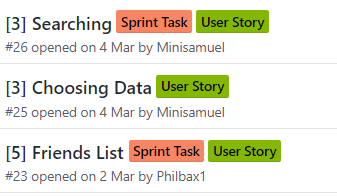

## SPRINT 4 : AGILE PRINCIPLE
# STORY POINTS

[NEXT](velocity.html){: .btn}
[BACK](scrumMaster.html){: .btn}

We began applying story points to each user story from the beginning of sprint 4. We assigned appropriate values relative to the previous sprint using fibonaci numbers.

[Agile Alliance: Continuous Deployment](https://www.agilealliance.org/glossary/points-estimates-in){:target="_blank"}

We understood that story points were an alternative to man hours to estimate the time and difficulty of completing a feature. 
It allowed us to create a benchmark for **velocity** based on sprint 3 and commit ourselves to developing more for sprint 4.
Story points also allowed us to discuss the time and difficulty using **Planning Poker**. We would go around suggesting a point to assign the task.
We would back this suggestion up with a reason and this would give insight to each person's perceived difficulty based on each individual's knowledge of the a solution, as well as their percieved risks involved. We agreed overall that Friendships and Calendar would be assigned 5 and Searching 3, because these were unfamiliar and required further research. 

Story Points added some added perspective of the scope of the entire sprint and the individual features. We felt that it would be necessary to organise the group into 3 subgroups in order to achieve these goals. 

#### Story Points

* in hindsight, despite knowing the magnitude of the tasks we were diving into, we chose to proceed and this would lead to our failure of sprint 4 as we focused solely on increasing output without considering other workloads. This would be explained in detail in Sprint 4 Reflection "Workload Overload".