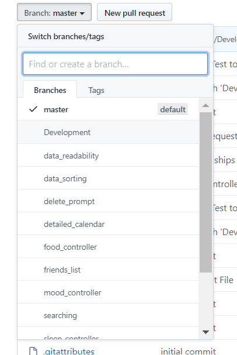
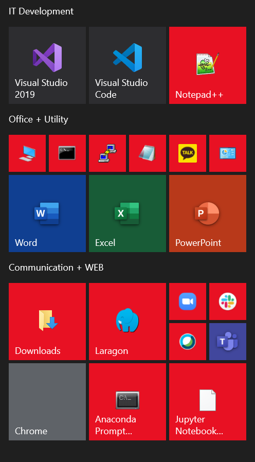

# SPRINT 1 : Technical Achievement

[NEXT](ta2.html){: .btn}

**Previous Section** [PERSONAL ACHIEVEMENTS](pa1.html){: .btn}

## Branching
Although this isn't a particularly complicated technical skill, it was important to coordinate the development process with branches. I made sure with my team mates that we were branching off correctly and merging would be conducted in an appropriate manner. 
I was used to branching in individual assignments. This would usually involve single active branch which would be merged before a new branch. However this project required multiple active branches.
It was a good opportunity for me to experience a development environment with multiple branches being developed simultaneously and solve merge conflicts in following sprints.

#### Branching

## Environment Set up
As we all had to have our own individual working environment, I had to install several applications onto my computer.
- GITBASH
- LARAGON
- VISUAL STUDIO CODE
- PHPMYADMIN
Unfortunately, I had always worked on polytechnic computers so just having a development environment was something to learn. My team members explained to me how Laragon worked. I had previous experience using Gitbash and visual studio code and phpmyadmin. It was fairly easy, despite running into problem with phpmyadmin on Laragon.
I am not a person who responds well to using NEW applications. Being exposed to new applications and learning to use them is making me more resilient, versatile, flexible. As a result I am now very comfortable around unfamiliar environments, situations and tools.

#### Set Up

