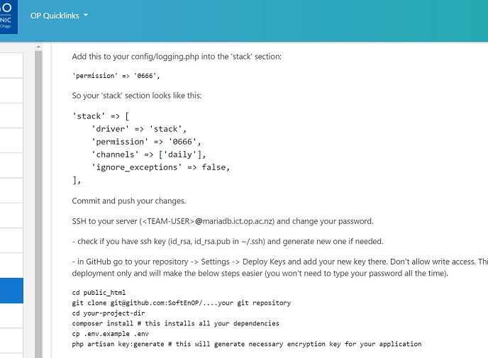

# SPRINT 2 : Technical Achievement

[NEXT](ta3.html){: .btn}
[BACK](ta1.html){: .btn}

## Resource controllers
The project originally had a single controller with all methods.
I developed the resource controller for weights records. 
I also created a new index page for the weights records to be displayed.
Most of the documentation followed was on https://laravel.com/docs/7.x/controllers
The site is now able to add, record, edit, delete weight records and these are processed from methods which are all organised in a dedicated resource controller for weights.

[Resource Controllers](https://laravel.com/docs/7.x/controllers){:target="_blank"}

## Deployment
I deployed the site on MariaDB with team members assisting in class.
I had never actually deployed a website before, so it was a new learning process. The github repository master branch would be pulled and and would be served on this address.
The machine would have its own mariaDB database.
The address was added to the github repository descriptions for easy reference and access.

#### Moodle Notes

