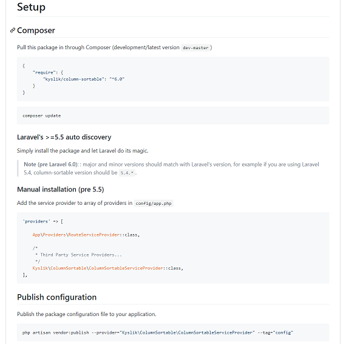

# SPRINT 3 : Technical Achievement

[NEXT](ta4.html){: .btn}
[BACK](ta2.html){: .btn}

## Kyslik - column sortable

As scrum master, and being influenced by the "surgical team" model, I took the initiative to find implementation solutions and share this knowledge with the group.

[Kyslik Sortable](https://github.com/Kyslik/column-sortable){:target="_blank"}

#### Kyslik Github Documentation

I was able to find a package that easily sorted tables according the each selected column.

This package also included pagination.

I started by reading the documentation and appropriate tutorials to implement this code to one table/model in our project.

After successfully testing a working concept, I had individual meetings with each member to show them how it worked by screen sharing.

I showed them the necessary lines of code needed to be implemented. And assigned Rohill, Phil and Dion a model and table each. The Kanban board was updated accordingly and I left comments throughout each table/model so members did not get lost in the coding process. I made sure to be available if they had trouble. 

Finding the package to sort tables of data was relatively easy to do. I was reminded by what Elise had told us that we should not try to reinvent the wheel. What we are developing has already been done before and finding this package made me realise that there would be other packages for other user stories to be resolved in the future.

This was a good experience for me to read through the documentation in detail. Tutorials as well as forums where users posted solutions to common problems also helped me understand how this implementation worked. Fully understanding this was crucial as I would be the most competent member to know how to solve a potential problem. It was my job to train members how the code worked in theory to increase our resilience to problems.