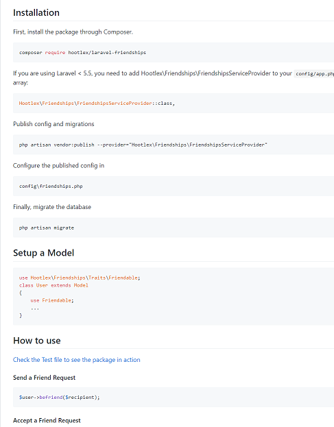
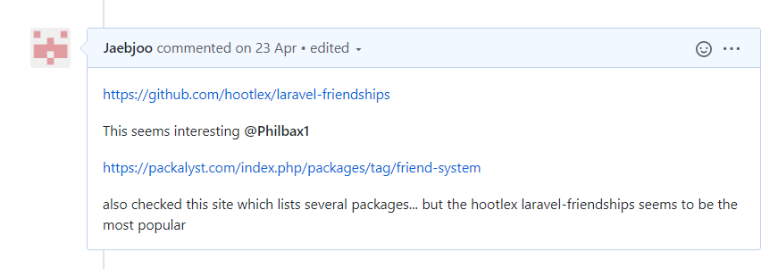

# SPRINT 5 : Technical Achievement

[NEXT](ta6.html){: .btn}
[BACK](ta4.html){: .btn}

## Hootlex Laravel-Friendships

[Hootlex Laravel-Friendships](https://github.com/hootlex/laravel-friendships){:target="_blank"}

#### Hootlex Laravel-Friendships Github Documentation

#### Sharing on Project Card

Once again just like Sprint 3 there was a choice to use an existing package to implement a friendship system to compliment the user model that we already had

**AGILE principle 10 :** Simplicity–the art of maximizing the amount of work not done–is essential

Initial installation involved the terminal command

**composer require hootlex/laravel-friendships**

The package creates a joining table between users which allows many to many relationships and statuses to be stored accordingly.

so if a record within the friendship table was **1 , 2 , 0**
It would mean that User 1 had initiated a relationship with user 2 and it had a status of **0** which meant that it was pending. 

There were also a collection of methods with the package, which allowed sending, accepting requests

example code..

**Sending Request**
$user->befriend($recipient);
**Accepting Request**
$user->acceptFriendRequest($sender);

The user model was to be changed also

use Hootlex\Friendships\Traits\Friendable;
class User extends Model
{
    **use Friendable;**
    ...
}

* A new view was created to display the list of the site's users for the the user to friend. 
* A seperate controller was created to handle the sending, accepting of friend requests.
* The controller was also able to access the database and query the friends and also pending requests using method

**$user->getAllFriendships();**

**$user->getPendingFriendships();**

This would select the friendships and pending requests to be displayed in a table on the user page. Buttons would be added with POST actions so that information would be sent to the controller to be processed.

I ran into issues with not knowing what information was needed to be passed to the methods. However, I was able to learn this by reading the documentation on the github repository for the package.

Overall, I completed the friendship feature to be merged to the development and ultimately to the master branch. There was use of **Timeboxing** and **Pair Programming** agile techniques used to develop the feature as mentioned in the Personal achievements of sprint 4