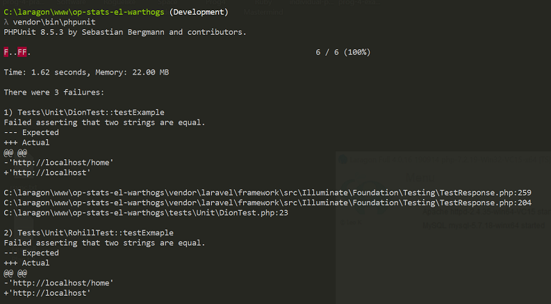

# SPRINT 6 : Technical Achievement

[BACK](ta5.html){: .btn}
[FIRST](ta1.html){: .btn}

**Next Section** [REFLECTIONS](r1.html){: .btn}

## Automated Testing

[Laravel Testing Documentation](https://laravel.com/docs/7.x/testing){:target="_blank"}

Documentation on the laravel website was used to conduct unit testing on the site. 

[Youtube Unit Testing Tutorial](https://www.youtube.com/watch?v=Jq-o99MaYCQ){:target="_blank"}

[Youtube Unit Testing Tutorial : Database](https://www.youtube.com/watch?v=TWOAPBnqx8U){:target="_blank"}

I watched tutorials to find examples of how testing was written and run.
I created my own test file to test.

#### Running Test

I see the value of the tests as methods can be created and run consistently even if the site is rapidly changing. The size of our project is relatively small and the development time was relatively short. Individual use cases and scenarios were limited with few features. However I see the value of automated testing in large projects with various use cases, which would exponentially increase the time required to test it if a person was to go through the website and individually click and test particular components and functions of a website rather than running a single test.